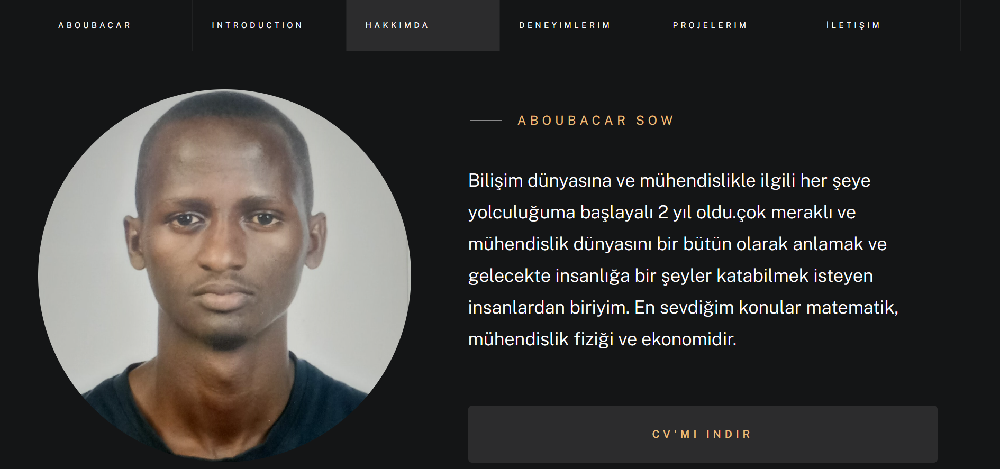

<html>
<head>
    <link rel="stylesheet" href="https://cdnjs.cloudflare.com/ajax/libs/font-awesome/5.15.4/css/all.min.css">
</head>
<body>

# My_Portfolio_ [🚀](https://img.shields.io/badge/Status-Active-brightgreen?style=flat-square)

#### This project is based on designing my portfolio dynamically, so we have inside the project's architecture, two (2) areas:
	 
	 <ul style="list-style:circle; margin-left:30px"> 
		<li> The web (portfolio itself,side that is visible for everyone) </li>
		<li> The Admin side, where i have the ability to manage the web side </li>
     </ul>

## Project's Details :

#### Technologies that have been used(under the capo) 🛠 :

   <ul style="list-style:circle; margin-left:30px"> 
		<li> HTML, CSS, BOOTSTRAP, FONT AWESOME </li>
		<li> .NET FRAMEWORK</li>
		<li> Entity Framework</li>
   </ul>

#### Data Base used 🗄️: 

<ul style="list-style:circle; margin-left:30px">
	<li>MSSQL</li>
</ul>

####  Approches and Pattern Used 📚 :

<ul style="list-style:circle; margin-left:30px">
	<li> Entity Framework Database First Approche </li>
	<li> MVC Design Pattern  </li>
	<li> Modal </li>
	<li> Session </li>
</ul>

## Portolio Itself

### Introduction 

### About Me 

### Qualifications

### My Background

### Last Projects

## Admin Side

### Category of Projects

###  Projects

### About Me

### Messages page

## Message's Details -Modal

## Login Page

## Study

## Qualifications

## References

 #### Diagram From MSSMS 

 

 
You can see, there is an relationship between these two tables. 

</body>

<html>
